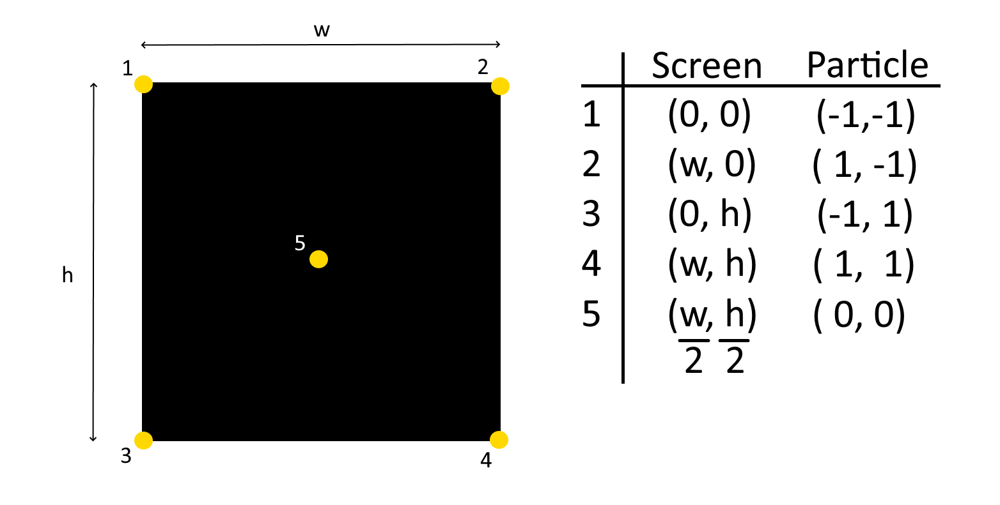
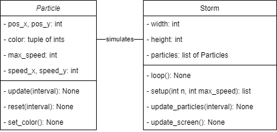
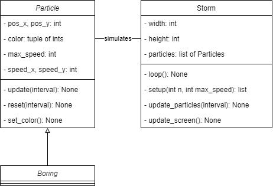
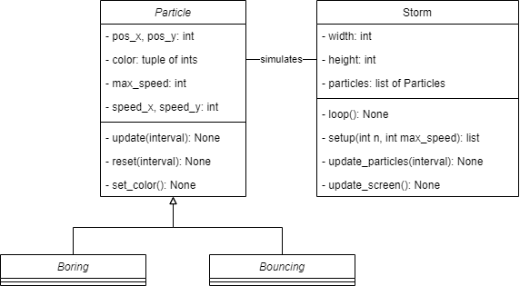
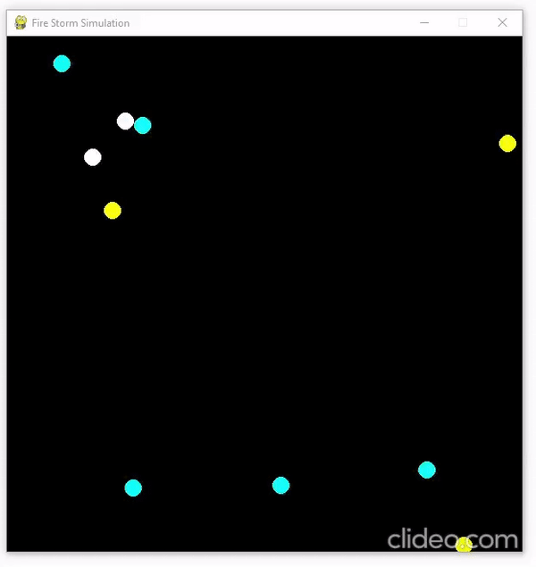
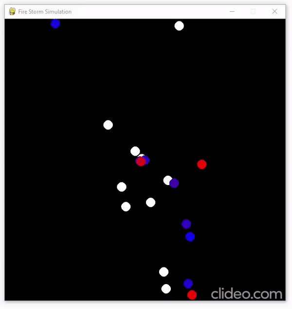

# Assignment
You will be making a Particle Storm. This is a simulation that will calculate the position of a number of particles, and then show them on the screen. Below is an example of what the end result could look like. You will start by creating the base implementation. After finishing the base, you will improve on it a number of times. Each new version will build on the previous ones. To incorporate these improvements, you will constantly edit and change the code you have previously written. For this reason it might be a good idea to sometimes make a copy of a stable build. The README will only tell you what to do, not exactly how to do it. Try experimenting with your code and look for a solution you think is best. 

  

## Base implementation
You have been given two files to start with. 
* `storm.py`: contains the pygame applications, it has already been completed. At the bottom you will find different objects of the class Storm. These correspond to the different versions you will have to make as described above. Always make sure all objects of Storm are commented, except for the version you are currently making.
* `particle.py`: contains the "physics" of the particle. The properties have already been given. It is your job to implement the methods `update()` and `reset()`. `set_color()` will come into play at a later point. you can also ignore the parameter `interval` in the method `update()`. It will be used in version 2 of the program. At the end of the base implementation, running `storm.py` will give the following result (assuming 120 FPS). Your result may vary depending on the given max_speed.

  

* `update()`: every time this method is called the x and y position of a particle should be increased by the value of their speed in the x and y direction.
* `reset()`: calls `__init__()` of the object when it's `pos_x` or `pos_y` are smaller/larger than -1/1. Read the below text for more info.

`storm.py` maps the coordinates of a particle to a pixel location on the screen. For example, when a particle has coordinates x=-1, y=1, it's pixel location on the screen will be x=0, y=SCREEN_HEIGHT (see below picture). As a result, particles whose `pos_x` or `pos_y` are smaller than -1 or larger than 1 will no longer be visible on the screen. You can check this yourself by running `storm.py` after completing the `update()` method. The `reset()` method will make it seem like a particle that went "out of bounds" despawned and caused a new particle to appear in the center (look closely at the above gif, what happens when particles reach the edge?).

  

## Version 2
The base implementation has a serious flaw. Set the FPS to 10 by changing self.clock.tick(120) to self.clock.tick(10) in `storm.py`. You should notice the particles moving quite a bit slower. In fact they move 12x slower! This is also shown in the below gif.

  

The reason for this can be found in the `loop()` method of Storm. The particles will only update their position when `update_particles()` is called. With 120 FPS this will happen 120 times per second. However, when FPS is only 10, it does this only 10 times per second. This makes it seem like the particles have a different speed depending on the FPS. This is of course bad design. Imagine a game that constantly speeds up or slows down depending on the current FPS.

It is possible to make the movement of particles FPS independent. For this the `interval` parameter should be used. The argument given to this parameter is equal to the time between two frames (in ms). So with 100 FPS, time between two frames is 10 ms. However, with 5 FPS, time between two frames is 200 ms. Your task for this version is changing the `update()` method of Particle (using `interval`) in such a way that the particles move the same distance during a certain time, regardless of FPS.

TIP: Say you have two simulations, one with 100 FPS, the other with 5 FPS. Calculate how far a random particle will move in each simulation during a second (speed being equal). What difference is there between the distances moved? Is there a way to make these distances equal by including `interval`?
* `interval` for 100 FPS : 10 ms.
* `interval` for 5 FPS   : 200 ms.

When implemented correctly, this is how the simulation can look (left is 10 FPS, right is 120 FPS). The particles seem to move the same distance. Do note that the simulation seems choppier when ran at 10 FPS.

  
  

## Version 3
The current implementation of the class Particle is limiting. What if we want a different movement pattern for certain particles (bouncing on edges, spinning, ...)? It would be better to use the class Particle as an interface class (template whose properties and methods are used by other classes).

Create a new class called Boring, it should inherit from Particle. In Boring create the methods `__init__()`, `update()` and `reset()`.
* `__init__()`: simply call the `__init__()` of Particle. Objects of Boring should have all the properties that objects of Particle have.
* `update()`: take the code in the `update()` of Particle, and place it in the `update()` of Boring. Make it so `update()` of Particle is empty (use pass).
* `reset()`: take the code in the `reset()` of Particle, and place it in the `reset()` of Boring. Make it so `reset()` of Particle is empty (use pass).

If you are not completely certain of what the end result should look like, you can always try something and then ask!

When implemented correctly, running version 3 of storm will seem exactly the same as version 2. However, it is now way easier to add new kinds of Particles to the program. It is handy for class Particle to still contain `update()`, `reset()` and `set_color()`, even if they are empty. This makes it clear to a programmer which methods he needs to implement when creating a new kind of particle. The below picure shows the difference between the class diagrams of version 2 and 3. 

<table class = "center">
  <tr>
    <th>Version 2</th>
    <th>Version 3</th>
  </tr>
  <tr>
  <td>
  
  </td>
  <td>
  
  </td>
  </tr>
</table>

## Version 4
With the framework in place it is now time to create a new kind of Particle, namely a Bouncing one (class Bouncing). The particle calls the `__init__()` of it's parent Particle, no new properties need to be added. Bouncing will behave similar to Boring, it's color will start of as white, and it will move towards the edge in a straight line. When reaching this edge it will not "respawn" like Boring. Instead it will bounce of off the edge. This bouncing will cause it's `speed_x` or `speed_y` to change, this depending on if it hit a horizontal or vertical edge (see gif). In addition, when bouncing against an edge it's color should change. You can choose for yourself how this will work exactly (in below gif, it becomes yellow when bouncing on vertical edges, and blue on horizontal edges). 

Because the particles bounce of the edge it is impossible for them to "go out of bounds", meaning that Bouncing particles will remain indefinitely. We want to change this. Every time the `reset()` method is called, a particle should have the possibility of "despawning" (having it's `__init__()` called). Create a threshold attribute and set it to a certain value between 0 and 1. Use the function `random()` and check if the generated number is higher than the threshold. If this is the case the Bouncing particle should despawn. You can also add this reset condition to Boring. This way slow moving Boring particles will also have a way of resetting.

TIP: think specifically how the methods `update()`, `reset()` and `change_color()` differ from Boring. Examine `reset()` in particular how will it change in comparison with the `reset()` of Boring?

TIP: how will speed_x and speed_y change after hitting an horizontal or vertical edge? In case your uncertain. Try drawing a figure with x- and y-axis. Imagine a particle bouncing of these axes. What was it's direction in the x- and y-direction before bouncing? What was it after?

TIP: the color of the particle is set using a mix of Red-Green-Blue. The maximum value that each of these base colors can have is 255. The minimum is 0.

<table class = "center">
  <tr>
    <th>Version 4</th>
    <th>Simulation</th>
  </tr>
  <tr>
  <td>
  
  </td>
  <td>
  
  </td>
  </tr>
</table>

EXTRA: Your current implementation of Bouncing `reset()` might not be FPS independent. Think about the following situation. With 120 FPS, the `reset()` for each particle will be called 120 times per second. If FPS is only 10, `reset()` will be called only 10 times per second. Is the particle running on 120 FPS more likely to despawn during 1 second than the same particle at 10 FPS? How would you go about fixing this?

## Version 5
Add a new kind of particle Spinning (class Spinning). This particle will spin clockwise whilst moving. The degree to which it spins should be random. It has the same conditions for respawning as Boring. It should change color depending on which direction it is moving (Example: red when moving horizontal, blue when moving vertical).

Below gif shows a mix of Boring and Spinning particles.

  

TIP: Is it easy to change the direction using speed_x, speed_y as parameters? Is there a different way to model a particle moving? What parameters would you need for this and how would it change `update()`? 

## Version 6
Add the final kind of particle to the simulation (class Gravitational). This particle is attracted to the center of the screen. It has the same conditions for respawning as Boring. It should change color depending on how far from the center it is (Example: pink when close, dark purple when far).

TIP: It is quite unlikely anyone will get this far. As a result the description is kept rather short. You can always ask if you need more information.

  

