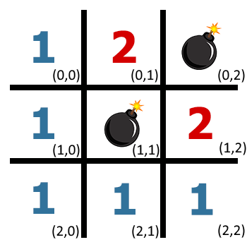
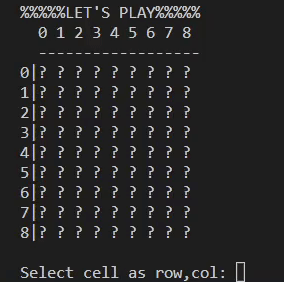
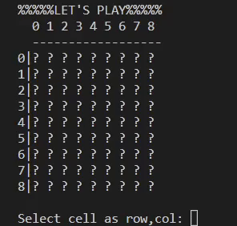

# Assignment
For this exercise you will be making the game Minesweeper in your terminal. This assignment is a combination of OOP with a bit of recursion. The explanation for each file can be found below.

Before starting this exercise it is best that you know the basics of Minesweeper. In case you need a refresher, play [the game](https://minesweeper.online/) for a bit.

## cell.py
In this file you will be making a class for each individual cell. Objects from this class should have three properties:
* `is_revealed`: Boolean to determine whether the cell has been uncovered. Starts False.
* `display_character`: Character representing the type of cell. (blank or mine).
* `neighbouring_mine_count`: Number to annotate how many mines there are in the surrounding 8 cell. Starts as 0.

From the above explanation it should be clear that only the `display_character` is obtained from outside the method (through a parameter).

## board.py
In this file you will be making a class for the Minesweeper *board*. This will be the largest file. Objects from this class should have five properties:
* `CHAR_MINE`: Character used to display a mine on the *grid*. It is full caps since it should never be changed. Default value is *.
* `CHAR_BLANK`: Character used to display a blank on the *grid*. It is full caps since it should never be changed. Default value is ?.
* `SQUARE_SIZE`: Number to indicate the length and width of the *grid*. The amount of cells in a grid is equal to *SQUARE_SIZE* **2. Default value is 9. 
* `covered_cells`: Number to indicate the amount of cell not yet uncovered. Should start of equal to (*SQUARE_SIZE* **2) - *MINE_NUMBER*. *MINE_NUMBER* is a parameter equaling the number of mines the *grid* should contain. The default value for *MINE_NUMBER* is 9.
* `grid`: 2D-List of cells. The amount of rows and columns are both equal to *SQUARE_SIZE*. Each position should be filled with an object of the class Cell. The display_character for all cells starts as *CHAR_BLANK*. 

Besides these five properties, when creating an object of the class Board. The following methods should be called:
*  A `generate_mines()` method that accepts an amount amount of mines (*MINE_NUMBER*). The method should convert a number of cells from blanks to mines. It does this by changing the display_character of the cell from *CHAR_BLANK* to *CHAR_MINE*. The cells to be changed should be chosen at random. When a randomly selected cell already contains a mine, the method should try again until it finds a cell containing a blank. Once again, the *MINE_NUMBER* should be equal to 9 by default, but can be changed when creating an object of the class Board. This represents how difficult the game will be.
*  A `calculate_neighbouring_mines()` method that accepts a row and column number. These numbers correspond to a particular cell on the *grid*. The method calculates how many of it's 8 neighbours contain a bomb (Tip: You will need two for-loops for this). Finally it changes the *neighbouring_mine_count* property of the cell to the amount of neighbouring bombs found (you are allowed to calculate the amount of neighbouring mines a for all cells. So also for those containing a mine themselves. This will not influence the future working of the game). 

For example a 3x3 grid containing two bombs would have the following cells (row,column):
<p align="center">
  
</p>

The class has several additional methods. First we will go over those that display the grid in the terminal. After completing each display method, check them by running a number of tests yourself. Using these display methods, you can also determine if all other methods and properties are implemented correctly.
* A `display_header()` method that accepts a message as an argument. This is a template that will be used in all other display methods. It will return a string containing the header of the display. The header consists of two parts. The first is the message, the second is the column numbering for the *grid*.  

In general the header will look as follows (assuming *SQUARE_SIZE*=9):
```
%%%%%{message}%%%%%%
  0 1 2 3 4 5 6 7 8
  ------------------
```

The message should be centered in between %, this should be the case no matter what the message written in it is. The total amount of characters on this line should be equal to `2*SQUARE_SIZE+2`. The column numbering should begin with two spaces. This room is necessary for adding the row numbers later on (see other display methods).

Some examples are:
```
%%Size=4%%      %%%%%%Size=8%%%%%%      %%%%%%%%%Size=12%%%%%%%%%%
  0 1 2 3         0 1 2 3 4 5 6 7         0 1 2 3 4 5 6 7 8 9 10 11
  --------        ----------------        ------------------------
```

* A `display_play_grid()` method. This will be used during the game to show the current state of the board. First, add the header to an empty string. Use `display_header()` for this. It should contain the message "LET'S PLAY". Afterwards add the body to the string. This body has a number of lines equal to *SQUARE_SIZE*. Each line should start with The current row number (starting at 0), followed by the "|" character. Then it should show the current state of that row. In case a cell is still covered it should add "*CHAR_BLANK* ". In case it has been revealed it should add "*cell.neighbouring_mine_count ". Mind the space in both cases! After completing the body, the entire string should be printed. (Tip: you will need to go through every cell in the 2D-grid. This is similar to the `get_picture()` method of exercise 1.11 Shape Fitter)

The empty square, without cells, should look like this by default (*SQUARE_SIZE*=9):
```
%%%%%LET'S PLAY%%%%%
  0 1 2 3 4 5 6 7 8
  ------------------
0|
1|
2|
3|
4|
5|
6|
7|
8|
```

Here are some examples at the start, during and end of the game:
```
%%%%%LET'S PLAY%%%%%        %%%%%LET'S PLAY%%%%%        %%%%%LET'S PLAY%%%%%
  0 1 2 3 4 5 6 7 8           0 1 2 3 4 5 6 7 8           0 1 2 3 4 5 6 7 8
  ------------------          ------------------          ------------------
0|? ? ? ? ? ? ? ? ?         0|0 0 0 0 0 0 0 0 0         0|0 0 0 0 0 0 0 0 0
1|? ? ? ? ? ? ? ? ?         1|0 0 0 0 0 0 1 1 1         1|0 0 0 0 0 0 1 1 1
2|? ? ? ? ? ? ? ? ?         2|1 2 1 1 0 0 1 ? ?         2|1 2 1 1 0 0 1 ? 1
3|? ? ? ? ? ? ? ? ?         3|? ? ? 1 1 1 2 ? ?         3|? 3 ? 1 1 1 2 1 1
4|? ? ? ? ? ? ? ? ?         4|? ? ? ? ? ? ? ? ?         4|2 ? 2 1 1 ? 2 ? 1
5|? ? ? ? ? ? ? ? ?         5|1 1 ? ? ? ? ? ? ?         5|1 1 1 0 1 1 3 ? 2
6|? ? ? ? ? ? ? ? ?         6|0 1 ? ? ? ? ? ? ?         6|0 1 1 1 0 0 2 ? 2
7|? ? ? ? ? ? ? ? ?         7|0 1 ? ? ? ? ? ? ?         7|0 1 ? 1 0 0 1 2 2
8|? ? ? ? ? ? ? ? ?         8|0 1 ? ? ? ? ? ? ?         8|0 1 1 1 0 0 0 1 ?
```
* A `display_mines_grid()` method, which will be handy during testing. First, add the header to an empty string. Use `display_header()` for this. It should contain the message "Mine Placement". Afterwards add the body to the string. This body has a number of lines equal to *SQUARE_SIZE*. Each line should start with The current row number (starting at 0), followed by the "|" character. Then it should show the state of each cell on that row. Do this by adding "*cell.display_character* " to the string. Mind the space! After completing the body, the entire string should be printed.

The mine placement for the above example is:
```
%%%Mine Placement%%%
  0 1 2 3 4 5 6 7 8 
  ------------------
0|? ? ? ? * ? ? ? ? 
1|? ? ? ? ? ? ? ? ? 
2|? ? ? ? * ? ? ? ? 
3|? * ? ? ? ? ? ? ? 
4|? ? ? ? ? ? ? * ?
5|? ? ? ? ? ? ? ? ?
6|? ? ? ? ? ? ? * ?
7|? * ? ? ? ? ? ? *
8|? * ? ? ? ? * ? ?
```

* A `display_neighbouring_mines_grid()` method, which will be handy during testing. First, add the header to an empty string. Use `display_header()` for this. It should contain the message "Neighbouring mines". Afterwards add the body of the string. This body has a number of lines equal to *SQUARE_SIZE*. Each line should start with The current row number (starting at 0), followed by the "|" character. Then it should show the neighbouring number of mines in case the cell is blank, and the *display_character* or *CHAR_MINE* if the cell contains a mine. After completing the body, the entire string should be printed.

The neighbouring mines for the above example is:
```
%Neigbouring mines%%
  0 1 2 3 4 5 6 7 8
  ------------------
0|0 0 0 1 * 1 0 0 0
1|0 0 0 2 2 2 0 0 0
2|1 1 1 1 * 1 0 0 0
3|1 * 1 1 1 1 1 1 1
4|1 1 1 0 0 0 1 * 1
5|0 0 0 0 0 0 2 2 2
6|1 1 1 0 0 0 1 * 2
7|2 * 2 0 0 1 2 3 *
8|2 * 2 0 0 1 * 2 1
```

After completing the display methods it is time to work on the logic of the board. For this we will be implementing the `cascade()` method that accepts a row and column number, indicating a certain cell in the *grid*. This method will change the *is_covered* properties of a number of cells in the grid to False. In Minesweeper this works as follows. When you select a cell with 0 neighbouring mines it will uncover that cell. Additionally, it will automatically open adjacent cells in all 8 directions until reaching a cell that does have a mine neighbouring it. See below gif for a visual on this rule (In the gif empty cells have 0 neighbouring mines.

<p align="center">
  
</p>

This cascading can be implemented using recursion. However, we will first implement a simpler version. After completing this simple version you should first finish the contents of *game.py*, before returning and implementing this method properly.

For the simple version, set the *is_covered* property for the cell with the given row and column number on the *grid* to False. This means that only the selected cell is uncovered. Below gif shows how it would work in our implementation of Minesweeper (The input of row and column will happen in a different method).

<p align="center">
  
</p>

As mentioned above, the proper version of the `cascade()` method uses recursion. The recursive method is more complicated than those in previous exercises. The reason for this is that there isn't just one base case. Before implementing the method think about following situations. When should the recursion take place and how many times should cascade be recursively called?
* `cascade()` is called with a row or column number that is outside of the board (example: row=-1,column=4 || row=3,column=8). 
* The given row and column number point to a cell with a mine.
* The given row and column number point to a cell with one or more neighbouring mines.
* The given row and column number point to a cell with no neighbouring mines.

In order to win the game, the program needs to know when there are no longer any cells covered. For this the *covered_cells* property was created. Every time a cell is uncovered (I.E. *is_covered* is set to False), the value of *covered_cells* should decrease by one.

Below gif shows the proper implementation of the `cascade()` method.

<p align="center">
  
</p>

## game.py
The final file is game.py. Here you shall implement the game loop and how the user interacts with the board. At the bottom of the file, the logic to activate the game when running this Python file is already given. Same goes for the game_loop.

Start by creating a class Game. It should have only one property:
* `board`: an object from the class Board.

Despite this it will need multiple parameters. Namely those that are required to create an object of Board. By default these parameters should have the same value as those from the `__init__()` of Board.

objects from the Game class will have following methods:
* A `get_user_choice()` method (see above gifs). The method will ask the player to select a cell by entering a row and column number, seperated by a comma. The function should split these numbers and return them seperately. However, before doing this the method will perform a number of tests. In case one tests fails the program will give an error message and ask again to select a cell. Following needs to be tested:
    * If the given input only contains numbers: "{number1},{number2}" (Tip: This can be done easily using an exception)
    * If the given input fits on the *grid* (so not smaller or larger than the *grid* dimension *SQUARE_SIZE*).
    * If the given input has not yet been visited (how do you know which cells have already been visited?) .
* A `make_move()` method. This method should call `get_user_choice()`, it will then use the obtained row and column number. First it will check whether the cell at this location contains a bomb. If this is the case it will return False. If it does not, it will call the `cascade()` method of the board. Finally it will check whether the board still has *covered_cells* if this is not the case, it will return True.
* A `game_loop()` method. This method contains the main loop that will execute the game. It has already been implemented.


